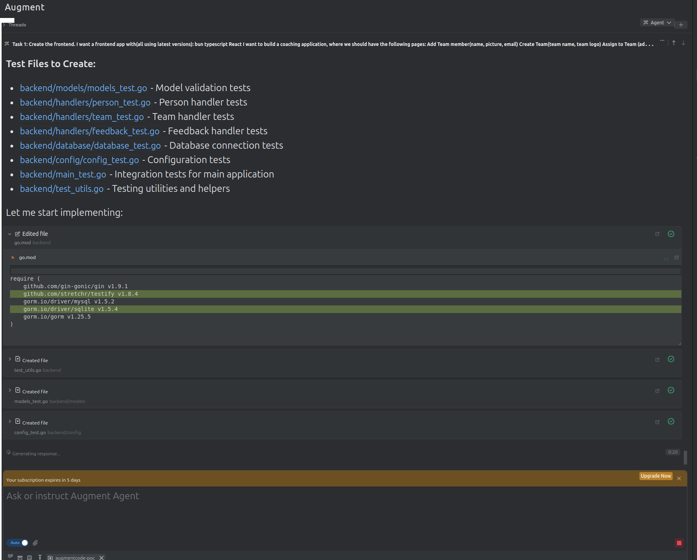

# Coaching Application

A full-stack coaching application built with React, Go, and MySQL. This application allows you to manage team members, create teams, assign people to teams, and provide feedback.

## 🚀 Quick Start

### Prerequisites
- Docker and Docker Compose
- Git

### Start the Application
```bash
# Clone the repository
git clone <repository-url>
cd augmentcode-poc

# Start the full stack
./start.sh
```

The application will be available at:
- **Frontend**: http://localhost:3000
- **Backend API**: http://localhost:8080
- **Database**: localhost:3306

## 🏗️ Architecture

### Frontend
- **React 18** with TypeScript
- **Bun** as package manager and runtime
- **React Router** for navigation
- **Vite** for build tooling
- **Nginx** for production serving

### Backend
- **Go 1.21** with Gin framework
- **GORM** for database ORM
- **MySQL 9** database
- **RESTful API** design

### Database
- **MySQL 9** with persistent storage
- **Automatic schema initialization**
- **Sample data included**

## 📁 Project Structure

```
├── frontend/           # React TypeScript application
│   ├── src/           # Source code
│   ├── Dockerfile     # Frontend container
│   └── nginx.conf     # Nginx configuration
├── backend/           # Go API application
│   ├── handlers/      # HTTP handlers
│   ├── models/        # Database models
│   ├── database/      # Database connection
│   ├── config/        # Configuration
│   └── Dockerfile     # Backend container
├── db/               # Database files
│   ├── schema.sql    # Database schema
│   └── mysql_data/   # Persistent data (gitignored)
├── docker-compose.yml # Service orchestration
└── start.sh          # Startup script
```

## 🎯 Features

### Team Management
- **Add Team Members**: Create profiles with name, email, and picture
- **Create Teams**: Set up teams with names and logos
- **Team Assignment**: Assign members to teams
- **Team Overview**: View team composition and member details

### Feedback System
- **Individual Feedback**: Provide feedback to specific team members
- **Team Feedback**: Give feedback to entire teams
- **Feedback History**: View all feedback with timestamps
- **Target Filtering**: Filter feedback by person or team

### Data Persistence
- **MySQL Database**: Reliable data storage
- **Persistent Volumes**: Data survives container restarts
- **Sample Data**: Pre-loaded with example teams and members

## 🛠️ Development

### Local Development
```bash
# Frontend development
cd frontend
bun install
bun run dev

# Backend development
cd backend
go mod tidy
go run main.go

# Database only
docker-compose up mysql -d
```

### API Endpoints

#### Persons
- `GET /api/v1/persons` - List all persons
- `POST /api/v1/persons` - Create person
- `GET /api/v1/persons/:id` - Get person by ID
- `PUT /api/v1/persons/:id` - Update person
- `DELETE /api/v1/persons/:id` - Delete person

#### Teams
- `GET /api/v1/teams` - List all teams
- `POST /api/v1/teams` - Create team
- `GET /api/v1/teams/:id` - Get team by ID
- `PUT /api/v1/teams/:id` - Update team
- `DELETE /api/v1/teams/:id` - Delete team

#### Feedback
- `GET /api/v1/feedbacks` - List all feedback
- `POST /api/v1/feedbacks` - Create feedback
- `GET /api/v1/feedbacks/:id` - Get feedback by ID
- `GET /api/v1/feedbacks/by-target` - Get feedback by target
- `DELETE /api/v1/feedbacks/:id` - Delete feedback

#### Assignment
- `POST /api/v1/assign` - Assign person to team

### Database Schema

The application uses three main tables:
- **people**: Team member information and team assignments
- **teams**: Team details and metadata
- **feedbacks**: Feedback entries for individuals and teams

## 🐳 Docker Commands

```bash
# Start all services
docker-compose up -d

# View logs
docker-compose logs -f

# Stop services
docker-compose down

# Rebuild and start
docker-compose up --build -d

# View service status
docker-compose ps
```

## 🔧 Configuration

### Environment Variables
- `DB_HOST`: Database host (default: mysql)
- `DB_PORT`: Database port (default: 3306)
- `DB_USER`: Database user (default: coaching_user)
- `DB_PASSWORD`: Database password (default: coaching_pass)
- `DB_NAME`: Database name (default: coaching_db)
- `PORT`: Backend port (default: 8080)

### Database Connection
The application automatically connects to MySQL using the configured environment variables. The schema is initialized automatically when the MySQL container starts.

## 🧪 Testing

### Frontend Tests
```bash
cd frontend
bun run test
```

### Backend Tests
```bash
cd backend
go test ./...
```

## 📝 Augment Code POC Notes

Augment Code agent in action


## Augment Code Trade-off Analysis | Experience notes

PROS
 * Was easy to install via IntelliJ plugin.
 * Was able to make it work and give tasks to the agent.
 * Uses Claude Sonnet 4.
 * Final result was good enough.

CONS
 * Did not use/detect my NVM and was trying to install node from scratch with brew.
 * Did not add the node_modules to the .gitignore file.
 * So first PR augment code open had 5K+ files and github only support ~ 3k
 * I had to intervene and fix some of the agent mistakes.
 * Augment code plugin: The font size in InteliJ is too small. Barely can read.
 * I could not install the vscode version for linux, it just do not authenticate it get stuck. 
 * There is a plugin for InteliJ but the plugin still run commands on the terminal just like the same as github copilot.
 * Slow. Claude Code and opencode are much faster.
 * Task 6 it just forget to open the PR - I had to remember it. 

## All PRs are available here

https://github.com/diegopacheco/augmentcode-poc/pulls?q=is%3Apr+is%3Aclosed

## Related POCs

* OpenAI Codex POC https://github.com/diegopacheco/codex-poc
* Google Jules https://github.com/diegopacheco/google-jules-poc
* Claude Code POC https://github.com/diegopacheco/claude-code-poc
* Cursor POC https://github.com/diegopacheco/docker-cleanup
* Gemini-cli POC: https://github.com/diegopacheco/gemini-cli-poc
* Sketch POC: https://github.com/diegopacheco/sketch-dev-poc